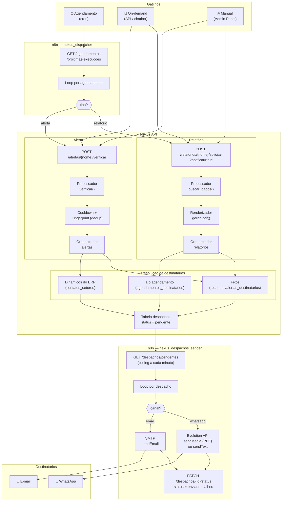
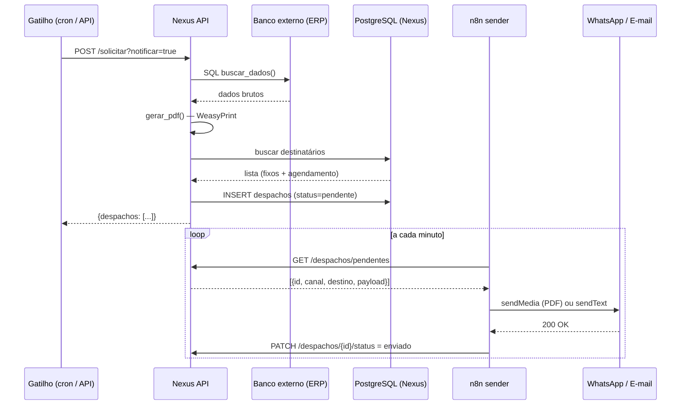
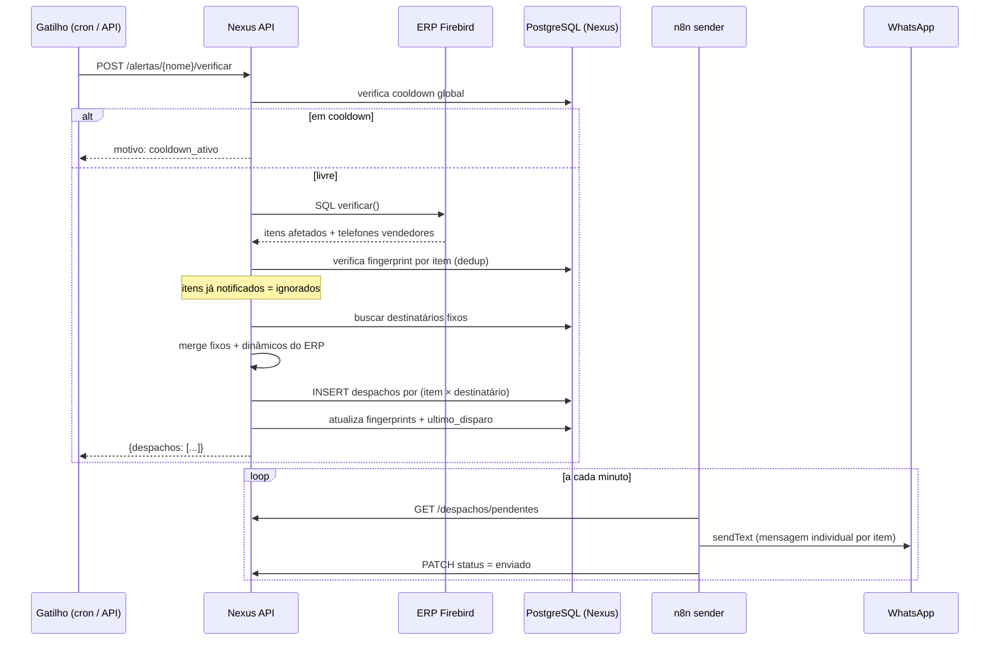
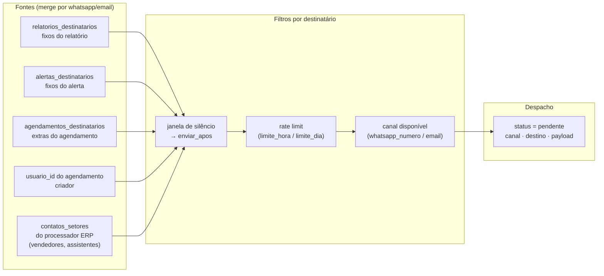
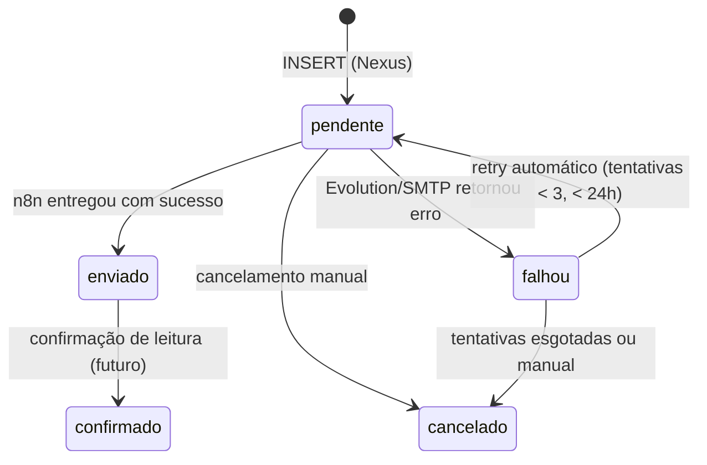

# Fluxo do sistema — Nexus

Visão completa de como um evento percorre o sistema, do gatilho até o destinatário.

---

## Visão geral

---

## Fluxo de relatório (detalhado)

---

## Fluxo de alerta (detalhado)

---

## Resolução de destinatários

---

## Estados de um despacho

